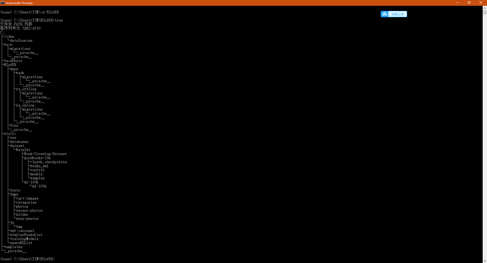
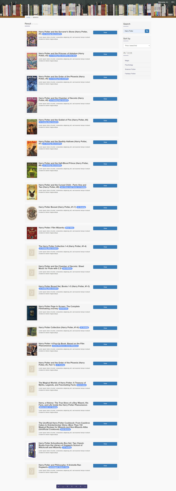

# 融合人脸识别登录的图书推荐系统
##### 注：本项目是笔者的2020年全国大学生计算机设计大赛参赛作品
***
* ## 项目结构

* face文件夹，是人脸识别系统的APP。
* facePhoto文件夹，是存放人脸图片的人脸库。
* static文件夹，是用来存放前端静态文件、数据集、训练集的文件夹。
* templates文件夹，故名思意是存放模板的文件夹，“模板”即是需要渲染的静态页面。
***
* ## 几点说明
1. 很明显，这里不是这个项目的全部。由于一些数据集和训练集比较大，而GitHub和Gitee要求每个文件不能超过100Mb的大小，所以删掉了一些CSV文件还有所有的训练集文件（训练集好几个G，实在太大了）。
2. 还有，这个项目不是我一个人独立完成的。从工程目录肉眼可见，它分为两个APP：一个是图书推荐系统相关的APP（RSofBX），而另一个是人脸识别系统相关的APP（face）。我负责完成的是人脸识别相关的APP，这个是我独立完成的。而图书推荐系统是学长写的，由于推荐系统工作量较大而且我比他跟熟悉Django，所以我也帮他写了些简单的页面响应函数来减轻他的负担。
3. 其它两个学弟负责项目的测试和调试。
4. 关于数据集：我们采用的是开源的1000-goodbooks的数据集，数据基本没有太多的错误，有错的数据在由CSV文件导入到MySQL时也会因为错误而无法写入，所以可以有效的解决数据的稀疏性。而项目一开始使用爬虫，爬豆瓣网的书，一是费时，二是由于豆瓣有反爬措施，总是锁IP使得程序中断，有时候数据还有错，总之来说效率极低，所以改用了1000-goodbooks的数据集。
***
* ## 关于推荐算法
这不是我的专长，这些功能主要是学长完成的。由于我为了帮他写些简单的响应函数，我特地的恶补一些推荐算法的基础知识，所以我在这把我知道的一点写出来，以供大家参考。  
使用的是混合推荐，主要有这几个算法：TopN、K-Means、KNN、SVD。具体可以看RSofBX的views.py文件。
***
* ## 关于人脸识别的实现
使用的是openCV进行人脸检测，人脸比对是使用的是基于Dlib和Cmake的face_recognition库。不出意料，这个库安装时会出现各种错误，具体都可以自行百度解决。
***
* ## 如何运行？
这是一个基于Django框架的WEB项目，所以直接按照Django的启动方法启动即可。所以，用CMD进入工程文件夹，键入“*python manage.py runserver*”即可，然后在浏览器里键入*127.0.0.1:8000*即可访问。
***
* ## 作品展示图
1. 人脸识别登录页面展示:

2. 未登录时的图书推荐页面：

3. 登录后的图书推荐页面：

4. 用户登录界面：

5. 图书详情页：

6. 搜索页面（搜索书名，以《哈利波特》为例）

7. 搜索页面（搜索作者名字，以JK罗玲为例）

***
END

